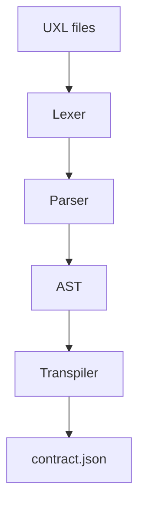

# uxl-core

**uxl-core** is the core of **UXL** — _User eXperience Lab_ / _UX eXperiment Language_.  
It ships the **lexer**, **Nearley parser** (with the current grammar), and a **transpiler** from AST to a stable **contract.json** that renderers/backends can consume.

> This is a **library**. You add it to your project and use its API.  
> Multi-file project loading, IMPORT resolution, and CLI live in **[uxl-kit]**.

---

## What’s inside

- Indentation-aware grammar and a custom **lexer**.
- **Parser**: a single UXL file → **AST**.
- **Transpiler**: AST (of a project) → **contract.json**.
- Debug helpers: parser `trace`, strict indentation (`baseIndent`, `strictIndent`), token stream via the lexer.

Minimal pipeline:


> IMPORT resolution, merging multiple ASTs and writing files to `dist/` is handled by **uxl-kit**.

---

## Install

```bash
npm i uxl-core
# or
pnpm add uxl-core

```
Requires Node.js 18+ (LTS recommended).

---

## Quick start
```js
import { parse, makeLexer, transpile } from "uxl-core";

const source = `
data cart:
  inline:
    items:
      id: "p1", title: "T-Shirt", price: 25.0, qty: 2
    total: 50.0
`;

// 1) Parse a single UXL file → AST
const ast = parse(source, { trace: false });

// 2) Transpile AST → contract (for a single file it will be partial)
const contract = transpile(ast);

console.log(JSON.stringify(ast, null, 2));
console.log(JSON.stringify(contract, null, 2));

```

> For a whole project (resolving `IMPORT`, merging all files) use **uxl-kit**. It loads everything, calls `transpile()`, and writes artifacts.

---

## Language concepts (short & practical)

- **Project** — a set of `.uxl` files with top-level definitions: `SCREEN`, `TEMPLATE`, `DATA`, `I18N`, `AB`, `EXPORT`, `IMPORT`.
- **Data** — data sources used by UI: inline JSON-like blobs, fixtures, or remote endpoints.
- **Screens & areas** — screen is a top-level UI surface; **areas** are named layout containers (`row`, `col`, `grid`) that hold items.
- **Components** — blocks you render; can have **props**, **bind** (data binding), nested areas, `when` conditions, `on` event handlers, `track`.
- **Props & binding** — `prop key: value` for constants and refs; `bind` for structured refs like `ref: cart.items` plus `mode`.
- **I18N** — locale dictionaries (`I18N en: …`, `I18N ru: …`) with `key: "value"`.
- **Events & navigation** — `on click: navigate(...)`, `record(...)`, `emit(...)`.
- **A/B** — `AB Name:` with `VARIANT` blocks and weights/percentages.
- **Include/Export** — reuse blocks across files; resolved during build (in **uxl-kit**).

```uxl
IMPORT "./shared.uxl"

data cart:
  inline:
    items:
      id: "p1", title: "T-Shirt", price: 25.0, qty: 2
      id: "p2",
        title: "Sneakers"
        price: 79.9
        qty: 1
    total: 129.9

I18N en:
  home.title: "Home"
  home.open_cart: "Open cart"
  home.greeting: "Welcome"

I18N ru:
  home.title: "Главная"
  home.open_cart: "Открыть корзину"
  home.greeting: "Добро пожаловать"

AB HeroTitle:
  VARIANT A (50%):
    component Banner:
      title: i18n.home.greeting
  VARIANT B (50%):
    component Banner:
      title: "Welcome back"

SCREEN Home:
  AREA hero: row
    # A/B content for the hero title
    AB HeroTitle

    component List "catalog":
      bind:
        items:
          ref: cart.items
          mode: stream
      itemRenderer: "ProductRow"

    component Button:
      text: i18n.home.open_cart
      on click:
        record(event: "click_open_cart", source: "home")
        navigate(to: "CartScreen", replace: false)

    track: event: "view_home", props: { anon: true }

```

---

## API

### `makeLexer(options?)`

Create a lexer with indentation settings.

- `tabWidth?: number` — default `4`
- `baseIndent?: number` — default `2`
- `strictIndent?: boolean` — default `false` (if `true`, enforces multiples of `baseIndent`)

Useful for token-level debugging.

### `parse(source: string, opts?: { trace?: boolean })`

Parse **one** UXL file into an AST.
- `trace: boolean` — verbose parser trace for diagnostics.

### `transpile(ast: ProjectAst)`

Walk a **merged** project AST and produce a stable **contract** object:
```js
{
  type: "contract",
  version: "0.1.0",
  screens: { /* ... */ },
  templates: { /* ... */ },
  data: { /* ... */ },
  i18n: { /* ... */ },
  ab: { /* ... */ }
}

```

> Exports/includes/imports must be resolved before transpilation (done by **uxl-kit**).

---

## AST shapes (informal, JS)

The real shapes are defined by `grammar.ne`. Below is a compact cheat sheet:
```js
// Root
const project = {
  type: "project",
  defs: [ /* top-level nodes below */ ]
};

// Data
const dataDef = {
  type: "data",
  name: "cart",
  source: {               // one of:
    kind: "inline", value: {/*…*/}   // inline blob
    // kind: "endpoint", url: "https://…"
    // kind: "fixture", value: {/*…*/}
  }
};

// I18N
const i18nDef = {
  type: "i18n",
  locale: "en",
  entries: [{ key: "home.title", value: "Home" }]
};

// Screen
const screenDef = {
  type: "screen",
  name: "Home",
  items: [/* Area | Component | When | On | Track | Include | Ab */]
};

// Area
const areaDef = {
  type: "area",
  name: "hero",
  layout: { kind: "row" },      // or { kind: "col" } / { kind: "grid", cols, gap }
  items: [/* AreaItem[] */]
};

// Component
const componentDef = {
  type: "component",
  ctype: "Button",
  cid: "primary",               // optional
  items: [
    { kind: "prop", key: "text", value: "Open cart" },
    { kind: "bind", entries: {/* normalized by grammar */} },
    { kind: "when", expr: {/* boolean AST */}, items: [/* area items */] },
    { kind: "on", event: "click", actions: [/* see below */] },
    { kind: "track", event: "view_home", props: { anon: true } },
    // nested areas/components/including etc.
  ]
};

// When
const whenBlock = { kind: "when", expr: {/* boolean AST */}, items: [/* area items */] };

// On
const onBlock = {
  kind: "on",
  event: "click",
  actions: [
    { type: "navigate", args: { to: "CartScreen", replace: false } },
    { type: "record",   args: { event: "click_open_cart" } },
    { type: "emit",     args: { name: "custom", payload: 42 } }
  ]
};

// Track
const track = { kind: "track", event: "view_home", props: { anon: true } };

// AB
const abDef = {
  type: "ab",
  name: "HeroTitle",
  variants: [
    { type: "variant", name: "A", weight: { kind: "percent", value: 50 }, items: [/*...*/] },
    { type: "variant", name: "B", weight: { kind: "percent", value: 50 }, items: [/*...*/] }
  ]
};

```

---

## Contract output (by transpiler)

The transpiler reduces the AST to a renderer-friendly contract:


```js
{
  type: "contract",
  version: "0.1.0",
  screens: {
    Home: {
      extends: null,
      items: [ /* normalized areas/components/when/on/track */ ]
    }
  },
  templates: { /* ... */ },
  data: {
    cart: { kind: "inline", value: { /* items, total */ } }
  },
  i18n: {
    en: { "home.title": "Home", /*...*/ },
    ru: { "home.title": "Главная", /*...*/ }
  },
  ab: {
    HeroTitle: { A: { /* weight or null */ }, B: { /* ... */ } }
  }
}

```

`uxl-kit` resolves imports/exports/includes before calling `transpile()`.

---

## Errors & debugging

- **IndentationError** — check that indentation is consistent; enable `strictIndent` to enforce multiples of `baseIndent`.
- **Syntax errors** — you’ll get line/column; turn on `trace` to see detailed parser steps.
- **Lexer debugging** — create a lexer via `makeLexer(...)`, feed it the source, and inspect the token stream.

---

## Rebuilding the parser from grammar

If you use Nearley CLI locally:
```bash
npx nearleyc grammar.ne -o parser.js
```

Add an npm script if convenient:
```json
{
  "scripts": {
    "build:parser": "nearleyc grammar.ne -o parser.js"
  }
}
```

> We recommend committing the generated `parser.js` so consumers don’t need Nearley at install time.

---

## Roadmap (core)

- Stabilize grammar & expand tests.
- Better error messages (contextual hints).
- Export JSON Schemas of AST/contract.
- Performance tuning for lexer/parser.
- Rich examples & fixtures in `examples/`.

> The broader ecosystem roadmap (renderers, runners, backend, Studio, SaaS) is in the root **UXL** repository.

---

## License

See **LICENSE**.

---

## Related

- Root project: [**UXLab**](https://github.com/simplizio/uxlab) (vision, docs, roadmap).
- Builder/CLI: [**uxl-kit**](https://github.com/simplizio/uxl-kit) (project build, IMPORT resolution, artifact output).

---

**TL;DR**: use `uxl-core` to parse UXL files into AST and transpile to a stable contract object. Use **uxl-kit** when you need project-level building and CLI.